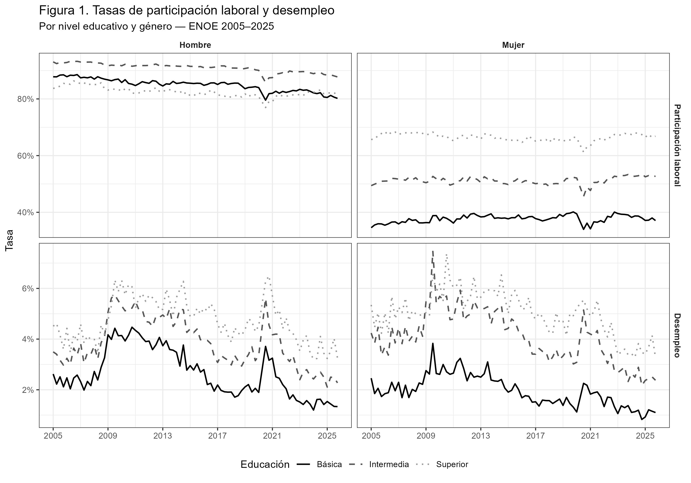
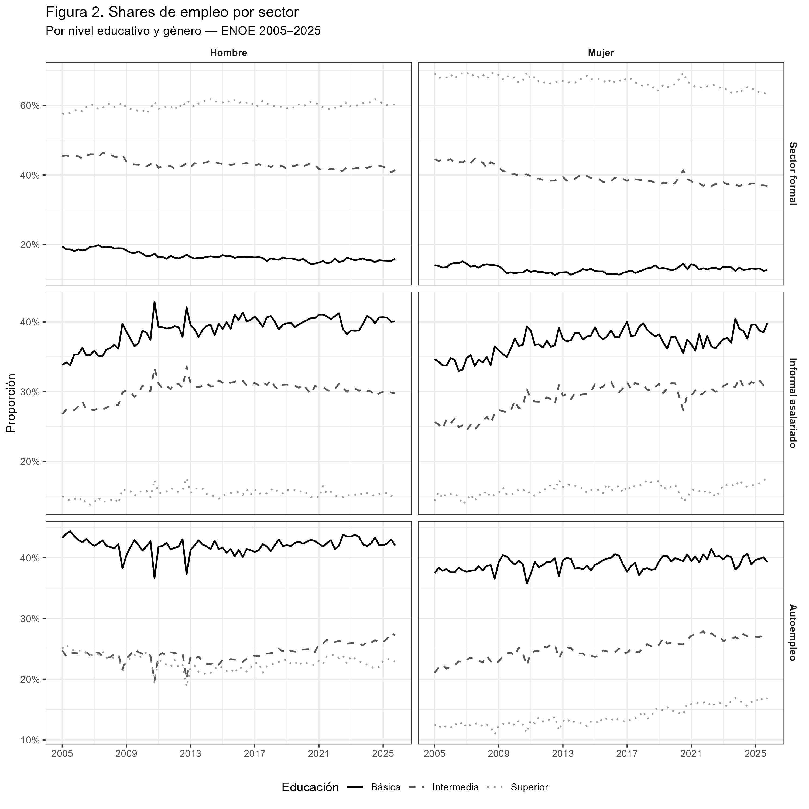
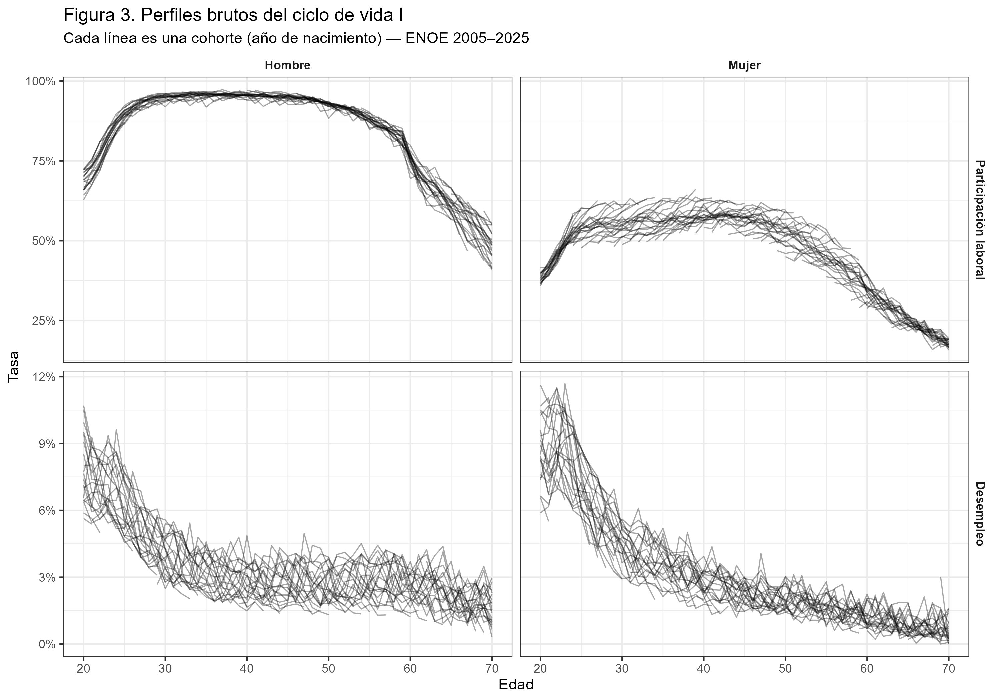
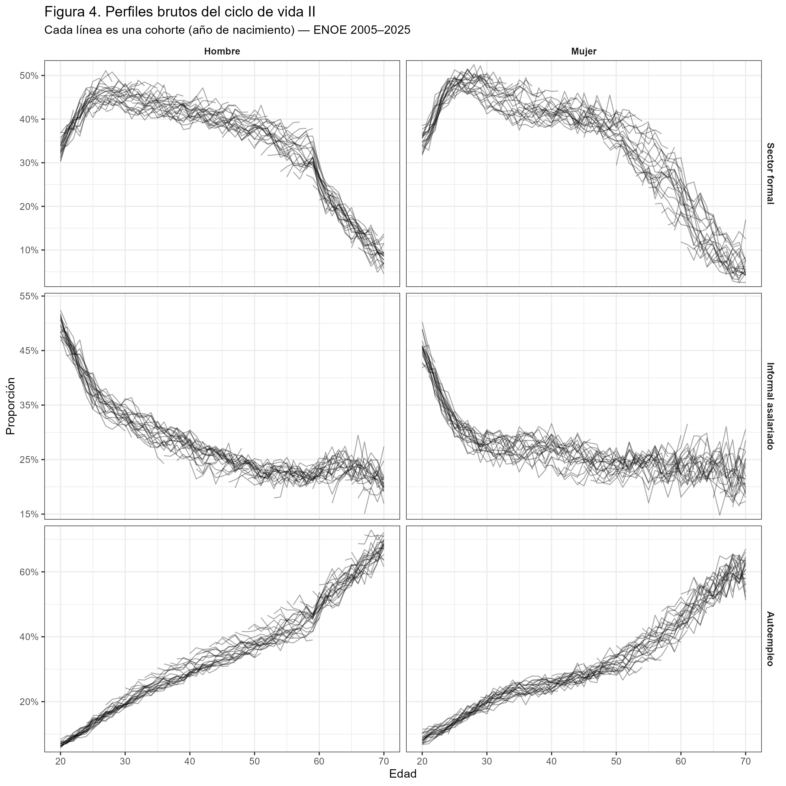

# Age Period Cohort Effects on Labor Market Trends in Mexico

**Disclaimer: esto forma parte de mis notas, así como del posible cuerpo
del texto.**

## Introducción

Este proyecto replica y extiende el análisis de Duval-Hernández & Orraca
Romano (2009) utilizando datos de la ENOE 2005–2025. El objetivo es
descomponer las tendencias del mercado laboral mexicano en tres
componentes:

- **Efecto edad** — cambios a lo largo del ciclo de vida individual.
- **Efecto cohorte** — diferencias generacionales persistentes entre
  grupos nacidos en distintos años.
- **Efecto tiempo** — fluctuaciones cíclicas asociadas al entorno
  macroeconómico.

La estimación sigue el método de Deaton (1997): un modelo de mínimos
cuadrados ponderados (WLS) en log-odds, con dummies completas para edad,
cohorte y período, donde el efecto tiempo se restringe a ser ortogonal a
una tendencia lineal. Las cohortes se definen por año de nacimiento,
nivel educativo (básica, intermedia, superior) y género.

Las variables de interés son: tasa de participación laboral, tasa de
desempleo, y los shares de empleo formal, informal asalariado y
autoempleo.

------------------------------------------------------------------------

## Estadísticas descriptivas

### Figura 1. Tasas de participación laboral y desempleo

Series de tiempo por nivel educativo y género, 2005–2025.

La participación masculina es alta y relativamente estable en todos los
niveles educativos. La participación femenina muestra una tendencia
creciente y una brecha educativa persistente: las mujeres con mayor
escolaridad participan significativamente más. El desempleo es
procíclico y la crisis financiera de 2008–2009 es visible como un
quiebre en ambos géneros.

------------------------------------------------------------------------

### Figura 2. Shares de empleo por sector

Proporción de trabajadores ocupados en sector formal, informal
asalariado y autoempleo, por nivel educativo y género, 2005–2025.

El empleo formal muestra una tendencia decreciente, especialmente
marcada en trabajadores con educación básica. El sector informal
asalariado ha crecido de forma sostenida y concentra a los trabajadores
con menor escolaridad. El autoempleo es relativamente estable en el
tiempo y más prevalente entre trabajadores de mayor edad.

------------------------------------------------------------------------

### Figura 3. Perfiles brutos del ciclo de vida I

Tasas de participación laboral y desempleo por edad. Cada línea
representa una cohorte (año de nacimiento).

La participación masculina sigue una curva de campana invertida clásica
con poco desplazamiento entre cohortes. La participación femenina
muestra cohortes ampliamente separadas verticalmente: generaciones más
recientes participan más a todas las edades. El desempleo es más alto en
edades jóvenes y cae rápidamente hacia la edad adulta.

------------------------------------------------------------------------

### Figura 4. Perfiles brutos del ciclo de vida II

Shares sectoriales por edad. Cada línea representa una cohorte (año de
nacimiento).

El empleo formal alcanza su pico en edades tempranas y declina con la
edad. El sector informal asalariado muestra el patrón inverso en edades
jóvenes y un repunte pasados los 50 años, consistente con trabajadores
que no pueden jubilarse. El autoempleo crece monótonamente con la edad
en todas las cohortes.

------------------------------------------------------------------------

## Cohorte

El cohorte se define con:

1.  Año de nacimiento
2.  Nivel educativo
3.  Género

## Variables analizadas

1.  Tasa de participación laboral
2.  Tasa de desempleo
3.  Share de empleo formal asalariado
4.  Share de empleo informal asalariado
5.  Share de autoempleo
