**Disclaimer: esto forma parte de mis notas, así como del posible cuerpo del texto.**

## Introducción

Este proyecto replica y extiende el análisis de Duval-Hernández & Orraca Romano (2009) utilizando datos de la ENOE 2005–2025. El objetivo es descomponer las tendencias del mercado laboral mexicano en tres componentes:

- **Efecto edad** — cambios a lo largo del ciclo de vida individual.
- **Efecto cohorte** — diferencias generacionales persistentes entre grupos nacidos en distintos años.
- **Efecto tiempo** — fluctuaciones cíclicas asociadas al entorno macroeconómico.

La estimación sigue el método de Deaton (1997): un modelo de mínimos cuadrados ponderados (WLS) en log-odds, con dummies completas para edad, cohorte y período, donde el efecto tiempo se restringe a ser ortogonal a una tendencia lineal. Las cohortes se definen por año de nacimiento, nivel educativo (básica, intermedia, superior) y género.

Las variables de interés son: tasa de participación laboral, tasa de desempleo, y los shares de empleo formal, informal asalariado y autoempleo.

---

## Estadísticas descriptivas

### Figura 1. Tasas de participación laboral y desempleo

Series de tiempo por nivel educativo y género, 2005–2025.

La participación masculina es alta y relativamente estable en todos los niveles educativos. La participación femenina muestra una tendencia creciente y una brecha educativa persistente: las mujeres con mayor escolaridad participan significativamente más. El desempleo es contracíclico y la crisis financiera de 2008–2009 es visible como un quiebre en ambos géneros, al igual que la crisis COVID-19.

---

### Figura 2. Shares de empleo por sector

Proporción de trabajadores ocupados en sector formal, informal asalariado y autoempleo, por nivel educativo y género, 2005–2025.

El empleo formal muestra una tendencia decreciente, especialmente marcada en trabajadores con educación básica. El sector informal asalariado ha crecido de forma sostenida y concentra a los trabajadores con menor escolaridad. El autoempleo es relativamente estable en el tiempo, aunque muestra una ligera tendencia al alza en mujeres con educación intermedia y superior. 
---

### Figura 3. Perfiles brutos del ciclo de vida I

Tasas de participación laboral y desempleo por edad. Cada línea representa una cohorte (año de nacimiento).

La participación masculina sigue una curva de campana invertida clásica con poco desplazamiento entre cohortes. La participación femenina muestra cohortes ampliamente separadas verticalmente: generaciones más recientes participan más a todas las edades. El desempleo es más alto en edades jóvenes y cae rápidamente hacia la edad adulta.

---

### Figura 4. Perfiles brutos del ciclo de vida II

Shares sectoriales por edad. Cada línea representa una cohorte (año de nacimiento).

El empleo formal alcanza su pico en edades tempranas y declina con la edad. El sector informal asalariado es más común en jóvenes y disminuye con la edad. El autoempleo crece monótonamente con la edad en todas las cohortes.

---

---

## Metodología de estimación

### Modelo APC

Se estima un modelo Edad-Periodo-Cohorte (APC) en el espíritu de Deaton (1997), especificado en log-odds de cada tasa de interés:

$$\text{logit}(p_{ct}) = \theta + \alpha_a + \kappa_c + \tau_t + \varepsilon_{ct}$$

donde $p_{ct}$ es la tasa de la celda definida por cohorte $c$ y periodo $t$, $\alpha_a$ es el efecto de la edad (ciclo de vida), $\kappa_c$ es el efecto de cohorte (diferencias generacionales persistentes) y $\tau_t$ es el efecto de periodo (fluctuaciones cíclicas). El modelo se estima por mínimos cuadrados ponderados (WLS) usando como pesos el número de observaciones no ponderadas de cada celda ($n_{obs}$).

### Identificación: normalización de Deaton

La identidad $\text{edad} = \text{año} - \text{año de nacimiento}$ introduce colinealidad exacta entre los tres efectos. Deaton (1997) propone reemplazar las $T$ dummies de periodo originales por $T-2$ dummies ortogonalizadas al espacio generado por una constante y una tendencia lineal. Los coeficientes resultantes satisfacen $\sum_t \tau_t = 0$ y $\sum_t t \cdot \tau_t = 0$, de modo que todo crecimiento tendencial se atribuye a los efectos de edad y cohorte, y $\tau_t$ captura únicamente las fluctuaciones cíclicas.

### Grupos de análisis y variables dependientes

El pseudo-panel se construye agrupando observaciones de la ENOE (2005–2025) por:

| Dimensión | Categorías |
|-----------|------------|
| Género | Hombre, Mujer |
| Nivel educativo | Básica (≤ 6 años), Intermedia (7–12 años), Superior (> 12 años) |
| Edad | 20 a 70 años |
| Periodo | Trimestres 2005T1–2025T4 |

Solo se conservan celdas con al menos 100 observaciones no ponderadas. Se estiman 30 modelos en total (6 grupos × 5 variables dependientes).

| Variable | Numerador | Denominador |
|----------|-----------|-------------|
| Tasa de participación | PEA | Población total |
| Tasa de desempleo | Desocupados | PEA |
| Empleo formal | Asalariados con seguridad social | Ocupados |
| Empleo informal asalariado | Asalariados sin seguridad social | Ocupados |
| Autoempleo | Empleadores + cuenta propia | Ocupados |

### Representación gráfica

Los perfiles de edad y cohorte se grafican en escala de probabilidad mediante la transformación logística inversa:

$$\hat{p} = \frac{e^{\hat{y}}}{1 + e^{\hat{y}}}$$

Para el **perfil de edad** se fija la cohorte nacida en 1956 como referencia; para el **perfil de cohorte** se fija la edad de 42 años. El efecto de periodo se presenta directamente en log-odds ya que, por construcción, su suma es cero y no tiene nivel de referencia natural. Los efectos estimados para otros cohortes y edades de referencia son, por construcción, desplazamientos de los perfiles mostrados. 

---

## Resultados APC

### Tasa de participación laboral

**Efecto edad ($\alpha_a$) — cohorte de referencia: 1956**

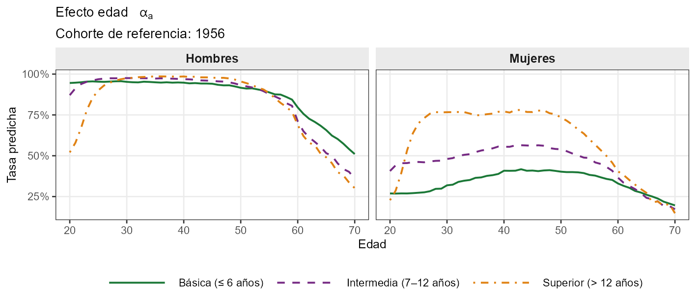

La participación masculina muestra una curva de campana invertida clásica. La femenina es creciente hasta los 40–45 años y cae más abruptamente; las mujeres con educación superior mantienen tasas significativamente más altas a lo largo de todo el ciclo de vida.

**Efecto cohorte ($\kappa_c$) — edad de referencia: 42 años**

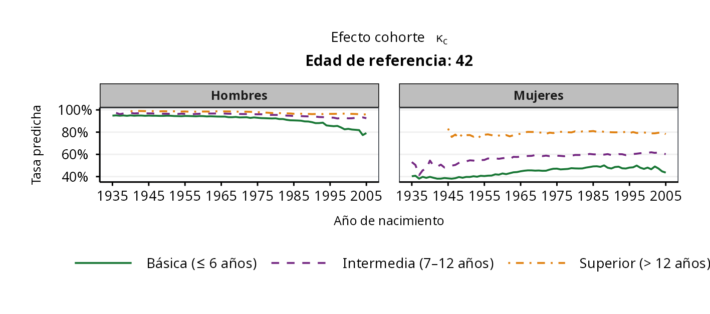

Cohortes femeninas más jóvenes participan consistentemente más que las precedentes, reflejando la tendencia secular de incorporación al mercado laboral. En los hombres el desplazamiento generacional es menor y sin una dirección clara.

**Efecto periodo ($\tau_t$)**

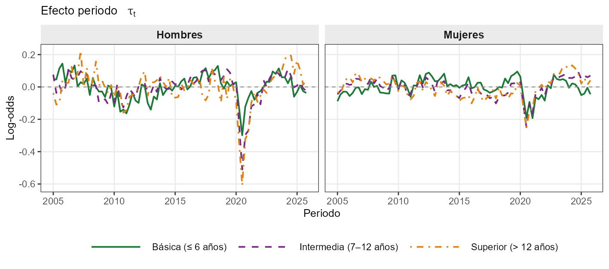

El componente cíclico de la participación es moderado. Se observa una caída en torno a 2008–2009 (crisis financiera global) y un deterioro pronunciado en 2020T2 (pandemia COVID-19), aunque el efecto esta exhacerbado por la disponibilidad de los datos en el tercer trimestre de 2020. La recuperación posterior es más rápida en hombres que en mujeres, especialmente en los grupos de educación intermedia y superior.

---

### Tasa de desempleo

**Efecto edad ($\alpha_a$) — cohorte de referencia: 1956**

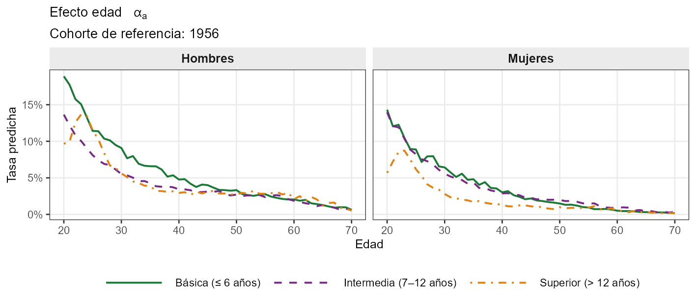

La tasa de desempleo es notablemente más alta en edades jóvenes y declina de forma pronunciada hacia los 30 años, consistente con el proceso de transición de la escuela al mercado laboral y la acumulación de experiencia.

**Efecto cohorte ($\kappa_c$) — edad de referencia: 42 años**

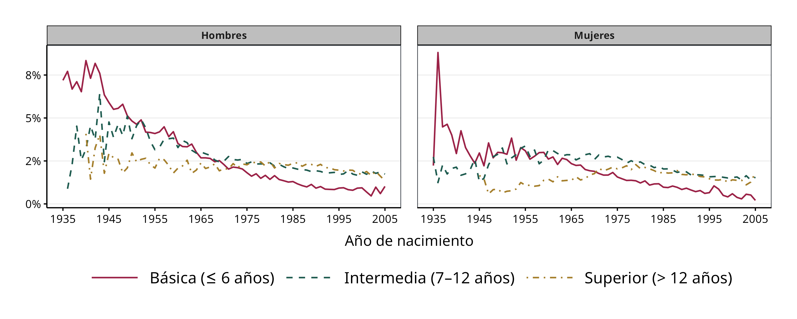

Las cohortes más jóvenes muestran tasas de desempleo de largo plazo ligeramente más bajas, particularmente para niveles de educación intermedia, lo que puede reflejar mayor selectividad en la búsqueda de empleo o mayor exigencia salarial en generaciones recientes.

**Efecto periodo ($\tau_t$)**

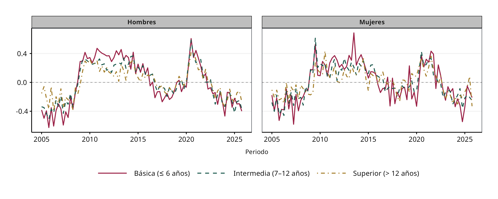

El desempleo es marcadamente procíclico. La crisis de 2008–2009 y el episodio de 2020 son los shocks más visibles, con magnitudes similares entre géneros.

---

### Empleo formal

**Efecto edad ($\alpha_a$) — cohorte de referencia: 1956**

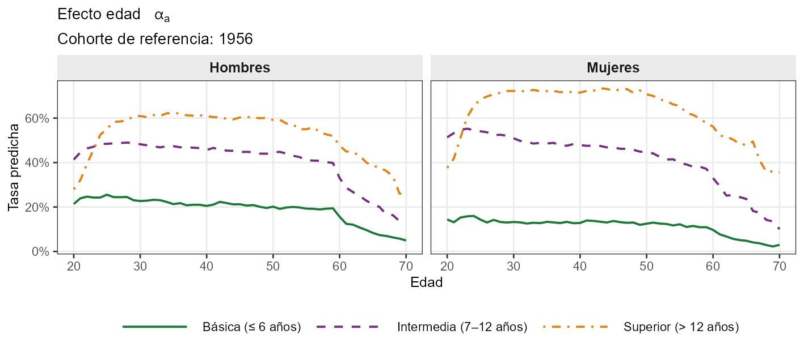

La probabilidad de empleo formal es más alta en edades medias (30–50) y declina en adultos mayores, reflejando las trayectorias típicas de salida del sector asalariado formal hacia el autoempleo o la inactividad.

**Efecto cohorte ($\kappa_c$) — edad de referencia: 42 años**

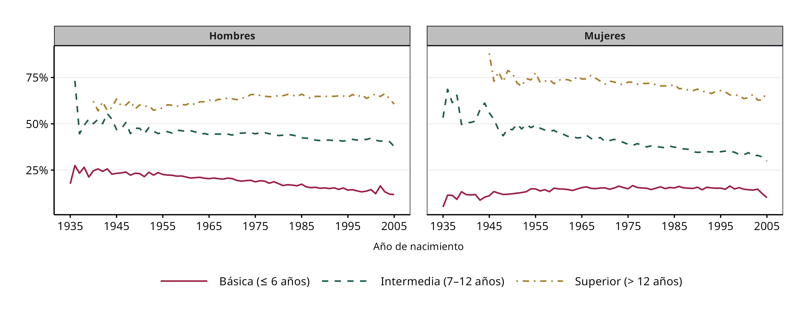

Las cohortes con educación superior muestran niveles de formalidad consistentemente más altos en todas las generaciones. No se aprecia una tendencia generacional clara en los grupos de educación básica e intermedia.

**Efecto periodo ($\tau_t$)**

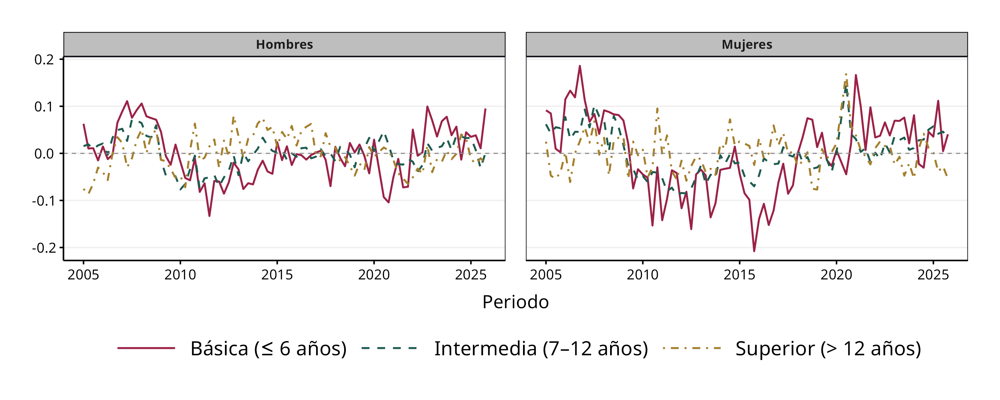

Los efectos de periodo son de menor magnitud que en la participación y el desempleo, con una ligera caída durante 2020 y recuperación posterior.

---

### Empleo informal asalariado

**Efecto edad ($\alpha_a$) — cohorte de referencia: 1956**

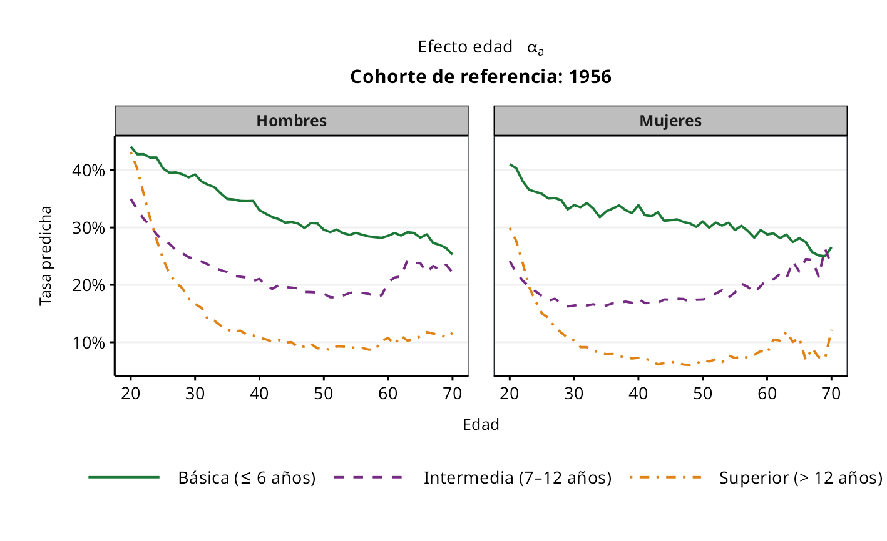

El empleo informal asalariado es más común en jóvenes y disminuye con la edad, reflejando en parte la transición hacia el autoempleo o la formalidad conforme se acumula experiencia laboral.

**Efecto cohorte ($\kappa_c$) — edad de referencia: 42 años**

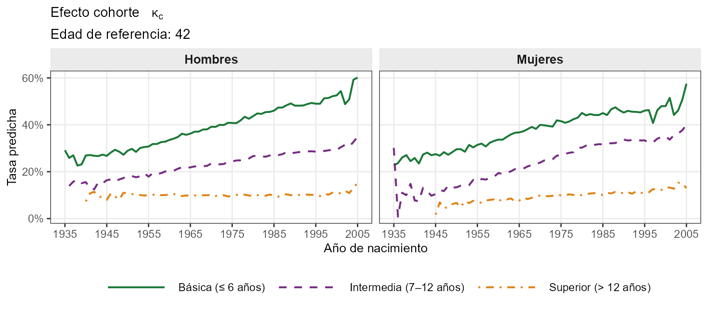

Las cohortes de educación básica presentan los mayores niveles de informalidad en todas las generaciones. No se observa una mejora generacional significativa, lo que sugiere que las barreras estructurales hacia la formalidad persisten independientemente de la cohorte.

**Efecto periodo ($\tau_t$)**

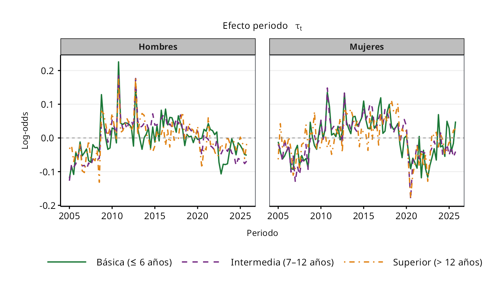

El componente cíclico muestra un incremento de la informalidad durante las crisis de 2008–2009 y 2020, consistente con el papel del sector informal como amortiguador en contextos de contracción del empleo formal.

---

### Autoempleo

**Efecto edad ($\alpha_a$) — cohorte de referencia: 1956**

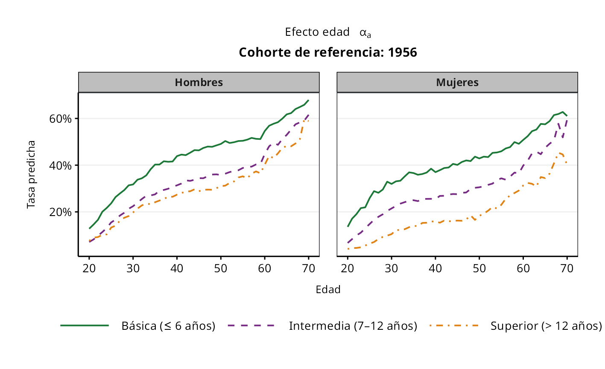

El autoempleo crece de forma monótona con la edad, especialmente en hombres. Este patrón refleja la acumulación de capital específico, redes de negocios y activos propios, así como la salida progresiva del empleo asalariado en edades más avanzadas.

**Efecto cohorte ($\kappa_c$) — edad de referencia: 42 años**

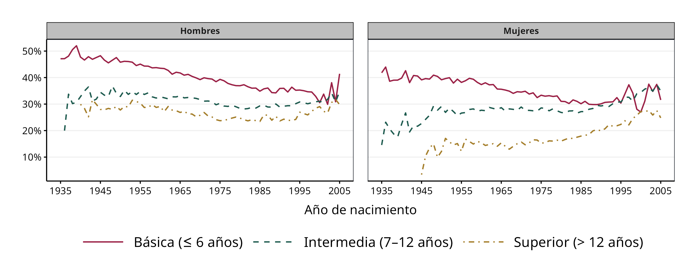

No se aprecian diferencias generacionales sistemáticas importantes, salvo que las cohortes con mayor nivel educativo presentan tasas de autoempleo consistentemente más bajas, posiblemente porque el empleo asalariado formal es más accesible para ellas.

**Efecto periodo ($\tau_t$)**

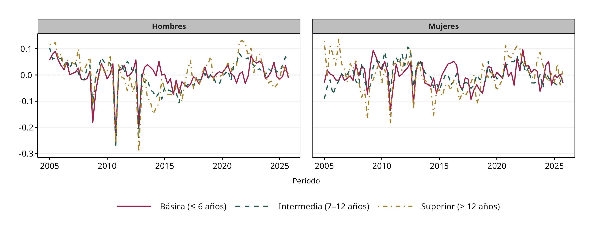

El componente cíclico del autoempleo presenta mayor variabilidad que el de los otros sectores, lo que es consistente con la entrada de trabajadores desplazados del empleo formal durante períodos de crisis económica.
